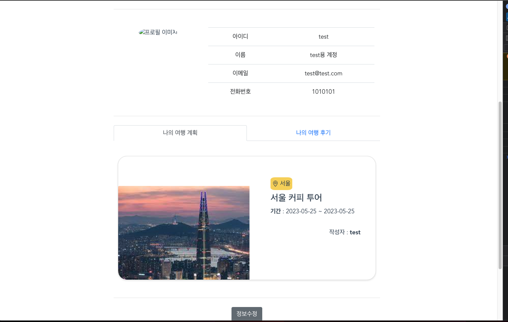

# Let's Travel The World

  

## **개요**

- 전국 관광지 데이터를 기반으로 편리한 여행 계획 작성을 목적으로 현재 핫한 여행지,실여행자들의 여행 후기 등을 제공

  

## 프로젝트 기간

- 2023년 05월 15일 ~ 2023년 05월 25일

 

 

  

## 기술 스택

   
   
   
   
   
   
  

######   

## 팀원

<table>
  <thead>
    <tr>
      <th>이름</th>
      <th>역할</th>
      <th>구현 기능</th>
    </tr>
  </thead>
  <tbody>
    <tr>
      <td rowspan="2">최준서</td>
      <td rowspan="2">팀장</td>
      <td> user 관련 백앤드 및 Front-end 전반 </td>
    </tr>
    <tr>
      <td> </td>
    </tr>
    <tr>
      <td rowspan="2">임규돈</td>
      <td rowspan="2">팀원</td>
      <td>여행 관련 백앤드 및 데이터 베이스 전반</td>
    </tr>
    <tr>
      <td> </td>
    </tr>
  </tbody>
</table>

  

## **DataBase 설계**

  

## 주요 기능

  

## 실행 화면

### 🔗 메인 페이지 - 핫한 여행지 소개 

✅ 현재 가장 핫한 여행지를 최상단에 보여줌 

  

### 🔗 메인 페이지 - 키워드 검색

✅ 해당 카드를 누르면 상세보기 페이지로 이동함 

  

---

### 🔗 여행계획 작성

✅ 원하는 여행지 추가 및 순서 조정을 통한 위치 파악 가능 

✅ 지도는 카카오 MAP API 사용

✅ 시, 구/군, 동 선택하면 그 지역에 존재하는 건물 마커로 표시

  

---

### **🔗 추천 여행 코스 보기 -**

✅ 사용자들이 작성한 여행 코스를 확인해 볼 수 있음

  

### **🔗 여행기 작성 - 자신이 갔던 여행에 관한 여행기 작성 가능**

✅ 자신이 갔던 여행에 대해 여행 후기를 작성할 수 있음

  

### **🔗 여행후기 공유**

✅ 여행 후기를 블로그 형태로 공유 가능.

  

### **🔗 특정지역 장소, 일정, 여행기 몰아보기기능 제공**

✅ 추가기능 구현 

  

### 🔗 회원가입

✅ 아이디 중복체크, 비밀번호 이중 체크

✅ 비밀번호, 비밀번호 확인이 같지 않으면 비밀번호가 일치하지 않음을 표시

  

---

### **🔗  로그인**

✅ 회원 로그인

  

----

### **🔗 마이페이지**

✅ 자신의 기본 정보 및 작성한 여행 계획, 후기 확인 기능 제공 

  

  

### **🔗 마이페이지 - 프로필 이미지 변경 및 정보 변경**

✅ 마이페이지에서 사용자 프로필 이미지 변경 및 개인정보 변경 가능 

  

